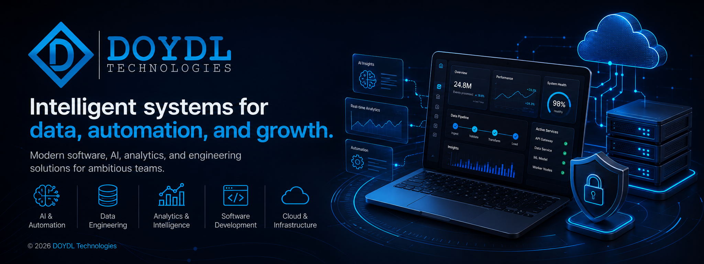

  

## DOYDL Technologies

DOYDL Technologies is a technology partner for finance teams and institutions operating at the bleeding edge.

We architect and deliver mission-critical fintech systems, applied AI infrastructure, quantitative tooling, and platform engineering for environments where precision, reliability, and security matter from the first commit.

## Focus Areas

* Applied AI and enterprise systems engineering
* Workflow automation and process intelligence
* Predictive analytics and financial modeling
* Custom tooling, integrations, and platform architecture
* Security-conscious engineering for regulated and adversarial environments

## Platforms and Operating Work

DOYDL Technologies develops and operates specialized technology platforms for finance, infrastructure, automation, and intelligence workflows.

## Operating Companies

### Paravane Labs

[Paravane Labs](https://github.com/paravaneai) is a DOYDL Technologies company focused on applied risk intelligence, operational decision support, developer tools, and secure infrastructure workflows.

Its work includes products such as [smtpRS](https://paravane.io/pages/products/smtprs.html), along with public SDKs, desktop applications, integration examples, and operational tooling.

* Website: [paravane.io](https://paravane.io/)
* GitHub: [github.com/paravaneai](https://github.com/paravaneai)

## Contact

For business inquiries, partnerships, or information about DOYDL Technologies and its operating companies:

* Website: [doydl.studio](https://doydl.studio/)
* Email: [social@doydl.studio](mailto:social@doydl.studio)
* Security: [security@doydl.studio](mailto:security@doydl.studio)

---

Precision architecture for finance, AI, and platform systems.
